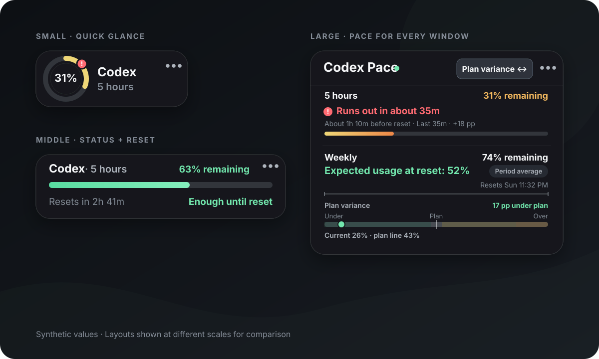

# QuotaPacer

[한국어](README.md) | [English](README_EN.md)

QuotaPacer는 Codex CLI가 보고하는 현재 계정의 남은 사용량과 사용 페이스를 작은 데스크톱 오버레이로 보여주는 비공식 크로스 플랫폼 앱입니다.

> 이 프로젝트는 OpenAI의 공식 제품이 아닙니다. Codex 인증 정보나 토큰을 직접 읽지 않고, 사용자가 설치하고 로그인한 Codex CLI의 app-server 인터페이스만 사용합니다.

제품 원칙과 기술·UX 결정은 [프로젝트 방향성](docs/PROJECT_DIRECTION.md)에 정리되어 있습니다.



## 핵심 기능

- 세 가지 정보 밀도의 항상 위 오버레이와 실제로 반환된 모든 제한 창 표시
- 사용 계획 비교, 예상 소진 시점과 인라인 경고 및 선택적 OS 알림
- 주기적 갱신, 변경 이벤트 반영, 연결 끊김 시 마지막 값 유지와 자동 재연결
- 드래그 이동, 투명도·언어·페이스 설정과 창 위치 저장
- 트레이와 더보기·우클릭 메뉴를 통한 크기 변경, 설정, 새로고침, 숨기기와 종료
- Codex CLI 자동 탐지와 오류 발생 시 실행 파일 직접 선택
- 한국어와 영어 UI

## 배포 상태

현재 공식 설치 파일은 제공하지 않습니다. GitHub Actions에서 Windows, macOS, Linux 빌드를 검사하지만 결과물을 배포하지 않으므로, 사용하려면 소스에서 직접 빌드해야 합니다.

## 사용 요구 사항

- Codex CLI 0.144.6 이상 권장
- 계정 사용량 조회를 지원하는 인증 방식으로 로그인된 Codex CLI (ChatGPT 로그인 권장)

Codex CLI가 없다면 [공식 Codex CLI 안내](https://developers.openai.com/codex/cli)에 따라 설치한 뒤 로그인합니다. API Key와 Amazon Bedrock 인증은 지원하지 않습니다.

CLI 버전은 안내 기준이며, 더 낮은 버전도 app-server 초기화와 필수 메서드가 정상 동작하면 사용할 수 있습니다.

## 소스 빌드

- Node.js 22.13 이상과 npm
- Rust stable 1.77.2 이상
- 플랫폼별 [Tauri 사전 준비 항목](https://v2.tauri.app/start/prerequisites/)

```sh
npm install
npm run tauri dev
```

배포용 빌드는 `npm run tauri build`로 생성합니다. Linux에는 WebKitGTK와 AppIndicator 개발 패키지가 추가로 필요합니다.

## 검사

```sh
npm run typecheck
npm run lint
npm test
cargo fmt --all --manifest-path src-tauri/Cargo.toml -- --check
cargo clippy --manifest-path src-tauri/Cargo.toml --all-targets -- -D warnings
cargo test --manifest-path src-tauri/Cargo.toml --lib
```

## 데이터와 개인정보

앱은 Codex 인증 토큰과 계정 이메일을 읽거나 저장하지 않습니다. 예측에 필요한 제한 창 식별자·리셋 시각·사용률·관측 시각과 알림 상태만 `pace-history.json`에 최대 25시간 보존하며 설정에서 삭제할 수 있습니다. 그 밖에는 CLI 경로와 오버레이 표시·페이스 설정을 저장합니다.

## 플랫폼 참고 사항

- macOS 투명 창은 Tauri private API를 사용하므로 현재 구성은 Mac App Store 배포 대상이 아닙니다.
- Linux의 항상 위, 포커스, 투명도와 창 위치는 X11·Wayland 및 데스크톱 환경에 따라 다를 수 있습니다.
- OS 알림과 다중 모니터·DPI 동작은 플랫폼별 수동 검증이 필요합니다.

## 라이선스

QuotaPacer는 [MIT License](LICENSE)로 배포됩니다. Pretendard 글꼴에는 별도의 [SIL Open Font License](src-tauri/resources/licenses/Pretendard-OFL.txt)가 적용됩니다.
